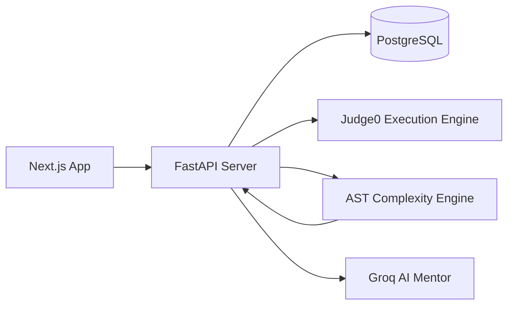

# AlgoArena

AlgoArena is a competitive programming platform tailored for Data Structures and Algorithms (DSA) training. It allows users to write and submit Python solutions, receive execution feedback via Judge0, get static Big-O complexity analysis, visualize recursion trees dynamically, and interact with an intelligent Socratic AI Mentor powered by Groq.

## System Architecture



## Key Features

1. **Intelligent AI Mentor**
   - The AI Mentor utilizes Socratic questioning via the Groq API to guide users toward the optimal approach rather than simply providing the solution.
   - Provides real-time syntax checking, algorithmic suggestions, and complexity hints.

2. **Visual Code Tracer (2D SVG Viewer)**
   - A fully interactive, 2D graph visualizer for recursion trees.
   - Features smooth bezier curves, draggable panning, zoom capabilities, and comprehensive node data.
   - Traces the exact Python execution path, hiding boilerplate class instantiation and cleanly formatting complex objects for high readability.

3. **Static Complexity Engine**
   - A custom Python AST parser infers the solution's Big-O Time Complexity without relying on arbitrary runtime scale tests.
   - Recognizes complex patterns such as nested loops, recursion branching, top-level sorting, and manual array-based memoization (dynamic programming), rewarding optimal O(N) solutions automatically.

4. **Judge0 Integration**
   - Async HTTP execution environment.
   - Evaluates code against multiple hidden test cases with strict memory and time limits.

5. **Modern Frontend**
   - Built with Next.js App Router, TailwindCSS, and Monaco Editor for a responsive and seamless coding experience.

## Project Structure

```text
AlgoArena/
├── apps/
│   ├── api/                  # FastAPI Backend
│   │   ├── models/           # SQLAlchemy DB models
│   │   ├── routers/          # API endpoints (trace, mentor, submissions)
│   │   ├── services/         # Core logic (AI, AST complexity, AST instrumentor)
│   │   └── main.py           # Application entry
│   └── web/                  # Next.js Frontend
│       ├── app/              # Next.js App Router pages
│       ├── components/       # React UI components (SvgTreeViewer, MentorPanel)
│       ├── lib/              # API and utility functions
│       └── tailwind.config.ts# Styling config
├── docker/                   # Docker containers (DB, Redis, etc.)
└── packages/                 # Shared logic packages
```

## Tech Stack & Dependencies

### Frontend
- **Framework:** Next.js (React 18)
- **Styling:** Tailwind CSS
- **Editor:** @monaco-editor/react
- **Icons:** lucide-react
- **Routing:** App Router

### Backend
- **Framework:** FastAPI
- **Database:** PostgreSQL (via SQLAlchemy)
- **AI Integration:** Groq API
- **Execution Engine:** Judge0
- **Tracing:** Python sys.settrace
- **Static Analysis:** Python ast module

## Local Setup Instructions

1. **Start Infrastructure (Database):**
   ```bash
   docker compose up -d
   ```

2. **Setup Backend:**
   ```bash
   cd apps/api
   python -m venv venv
   # Windows:
   venv\Scripts\activate
   # Mac/Linux:
   source venv/bin/activate
   
   pip install -r requirements.txt
   python ..\..\scripts\seed_problems.py
   ```

3. **Configure Environment Variables:**
   Copy the `.env.example` files to `.env` and configure your credentials.
   - `apps/api/.env` (Requires `GROQ_API_KEY`)
   - `apps/web/.env.local`

4. **Run Backend Server:**
   ```bash
   uvicorn main:app --reload --port 8000
   ```

5. **Run Frontend App:**
   ```bash
   cd apps/web
   npm install
   npm run dev
   ```

6. Open your browser to http://localhost:3000.

## Security

All API keys and secrets (like `.env` files) are explicitly ignored by `.gitignore` and are loaded dynamically at runtime to ensure credentials are never pushed to the repository.
